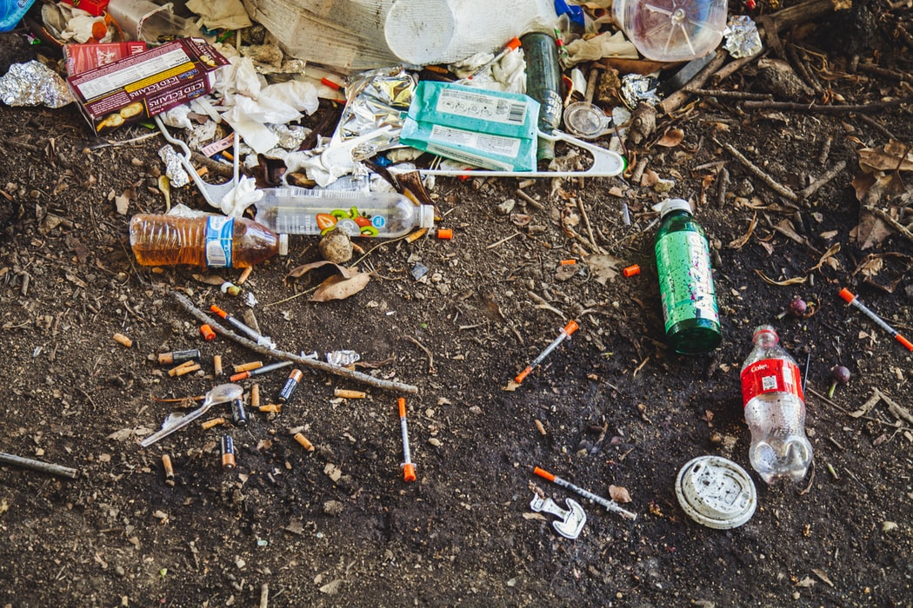
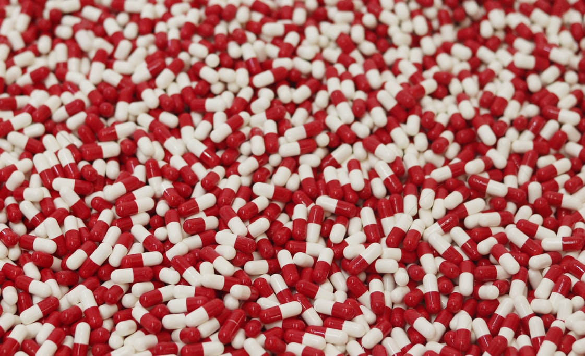

<!-- Main -->

<!-- One — Introducción -->
<section id="one">
  

    <header class="major">
      <h2>Mitos&nbsp;y&nbsp;Drogas</h2>
    </header>

  
<strong>Mitos y Drogas</strong> es un proyecto independiente creado por <em>Gerardo Ortega Alcocer</em> con el propósito de ofrecer <strong>información científica, comprensible y sin estigma</strong> sobre sustancias psicoactivas en México. A través de contenidos interactivos, guías de reducción de daños y acompañamiento legal, el sitio busca que cada persona usuaria ejerza su derecho a la salud y a la autodeterminación.

  
La plataforma reúne fichas detalladas de sustancias, análisis legales actualizados y recursos prácticos para situaciones cotidianas —desde festivales de música hasta encuentros con la autoridad— con un enfoque de derechos humanos.

  
También incluye <a href="{{ site.interacciones_url }}" target="_blank" rel="noopener noreferrer">Interacciones</a>, una herramienta interactiva para comparar dos sustancias y revisar sinergias, riesgos, expectativas e información útil antes de tomar decisiones.

  

</section>

<!-- Two — Spotlights: se conservan imágenes y flujo original -->
<section id="two" class="spotlights">

  <section>
    
    

      

        <header class="major"><h3>Sustancias</h3></header>
        
Catálogo interactivo con nombres alternativos, dosis, efectos, riesgos y primeros auxilios por cada molécula.

        <ul class="actions">
          <li><a href="/drogas" class="button">Ver sustancias</a></li>
        </ul>
      

    

  </section>

  <section>
    
    

      

        <header class="major"><h3>Adicciones</h3></header>
        
Información sobre dependencia, neurobiología y tratamientos basados en evidencia.

        <ul class="actions">
          <li><a href="/adiccion" class="button">Aprende más…</a></li>
        </ul>
      

    

  </section>

  <section>
    
    

      

        <header class="major"><h3>Legalidad</h3></header>
        
Guías sobre derechos, cantidades de tolerancia, procesos ante el Ministerio Público y legislación emergente.

        <ul class="actions">
          <li><a href="/legalidad" class="button">Consultar artículo</a></li>
        </ul>
      

    

  </section>

  <section>
    
    

      

        <header class="major"><h3>Interacciones</h3></header>
        
Herramienta interactiva para elegir dos sustancias y consultar posibles sinergias, riesgos y recomendaciones prácticas de reducción de daños.

        <ul class="actions">
          <li><a href="{{ site.interacciones_url }}" class="button" target="_blank" rel="noopener noreferrer">Abrir herramienta</a></li>
        </ul>
      

    

  </section>

</section>

<!-- Three — Visión y objetivos -->
<section id="three">
  

    <header class="major"><h2>Visión y objetivos</h2></header>

  
<strong>Mitos y Drogas</strong> nace como una organización de divulgación científica, educación pública y reducción de daños orientada a transformar la forma en que México y América Latina hablan sobre sustancias psicoactivas: con evidencia, dignidad, pensamiento crítico y responsabilidad social. Su visión parte de que la reducción de daños no promueve el consumo, sino que busca disminuir sus consecuencias negativas en salud, sociedad y derechos, especialmente frente a contextos de criminalización, desinformación y estigma.<a href="#ref-acerca-1">1</a>Harm Reduction International. What is Harm Reduction?

  <ul>
    <li><strong>Construir información clara, rigurosa y accesible</strong> sobre sustancias psicoactivas, integrando neurociencia, farmacología, historia, salud pública, cultura y política de drogas para combatir mitos, prejuicios y narrativas alarmistas.</li>
    <li><strong>Promover una cultura de reducción de daños en México y América Latina</strong>, ofreciendo herramientas prácticas para la prevención, el autocuidado y la toma de decisiones informada de personas usuarias, familias, comunidades e instituciones.</li>
    <li><strong>Consolidarse como una NGO latinoamericana referente en investigación de frontera y divulgación pública</strong>, capaz de vincular ciencia, educación, derechos humanos y acción comunitaria frente a un panorama global de drogas cada vez más complejo.<a href="#ref-acerca-2">2</a>UNODC. World Drug Report 2025.</li>
  </ul>

  
Consulta la sección de <a href="/congresos" class="link">Congresos</a> para ver la participación de Mitos y Drogas en foros académicos y profesionales.

  <h3>Referencias</h3>
  <ol>
    <li id="ref-acerca-1">Harm Reduction International. <a href="https://hri.global/what-is-harm-reduction/" target="_blank" rel="noopener noreferrer">What is Harm Reduction?</a></li>
    <li id="ref-acerca-2">United Nations Office on Drugs and Crime. <a href="https://www.unodc.org/unodc/data-and-analysis/world-drug-report-2025.html" target="_blank" rel="noopener noreferrer">World Drug Report 2025</a></li>
  </ol>
  

</section>

<!-- Four — Gerardo Ortega Alcocer -->
<section id="four" class="spotlights">
  <section>
    
    

      

        <header class="major"><h3>Gerardo Ortega Alcocer</h3></header>

        
Estudiante de último año de la Licenciatura en Biología Experimental (UAM) y asistente de investigación en el área de neurociencias del Instituto Nacional de Psiquiatría <em>“Ramón de la Fuente Muñiz”</em>. Ha colaborado en proyectos pre-clínicos sobre psicodélicos y analgesia, y divulga ciencia desde 2016 mediante conferencias, podcasts y talleres.

        
<strong>Contacto directo:</strong> <a href="mailto:gerardo@mitosydrogas.org">gerardo@mitosydrogas.org</a>

        
<strong>Redes:</strong>
          <a href="https://twitter.com/mitosydrogas" target="_blank">Twitter</a> |
          <a href="https://instagram.com/mitosydrogas" target="_blank">Instagram</a> |
          <a href="https://fb.me/mitosydrogas" target="_blank">Facebook</a>
        

      

    

  </section>
</section>

<!-- Five — Participa -->
<section id="five">
  

    <header class="major"><h2>¿Quieres colaborar?</h2></header>
    
Diseño gráfico, desarrollo web, traducción, asesoría legal o donativos: cada aporte fortalece la misión.

    <ul class="actions">
      <li><a href="/involucrate" class="button next">Involúcrate</a></li>
    </ul>
  

</section>

